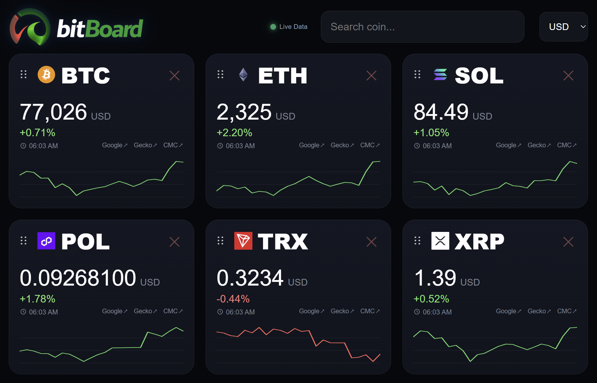

# bitBoard

A customizable crypto price dashboard for Umbrel.

bitBoard helps you monitor cryptocurrency prices in real time through a fast, clean and customizable dashboard running on Umbrel.

---

## Why bitBoard?

bitBoard focuses on speed, clarity and quick access to market prices.

It provides a dedicated dashboard experience that works well on desktops, tablets, secondary monitors and always-on displays.

Build your own personalized board and keep it running all day.

---

## Features

- Live cryptocurrency prices
- Clean dark interface
- Add and remove coins instantly
- Search supported crypto assets
- Drag & drop card reordering
- Multi-currency support
- Lightweight and responsive
- Runs locally on Umbrel

---

## Screenshot

---

## Great For

- Home office dashboards
- Secondary monitors
- Tablet displays
- Daily market tracking
- Crypto enthusiasts running Umbrel

---

## Installation

Install **bitBoard** directly from the Umbrel App Store.

Launch the app and start building your dashboard in seconds.

---

## Usage

1. Open bitBoard  
2. Search for a coin  
3. Add it to your board  
4. Rearrange cards freely  
5. Monitor prices live

---

## Supported Quote Currencies

Supports USD, EUR, BRL, BTC, ETH and multiple additional quote currencies.

---

## Data Sources

bitBoard uses public market data from CoinGecko for cryptocurrency pricing.

As with any public API, temporary rate limits or short interruptions may occasionally affect update frequency.

No exchange account or API key is required.

---

## Design Principles

- Fast and lightweight
- Clear over complex
- Useful over noisy
- Self-hosted convenience
- Practical by default

---

## Developer

egzola

GitHub  
https://github.com/egzola

---

## License

MIT